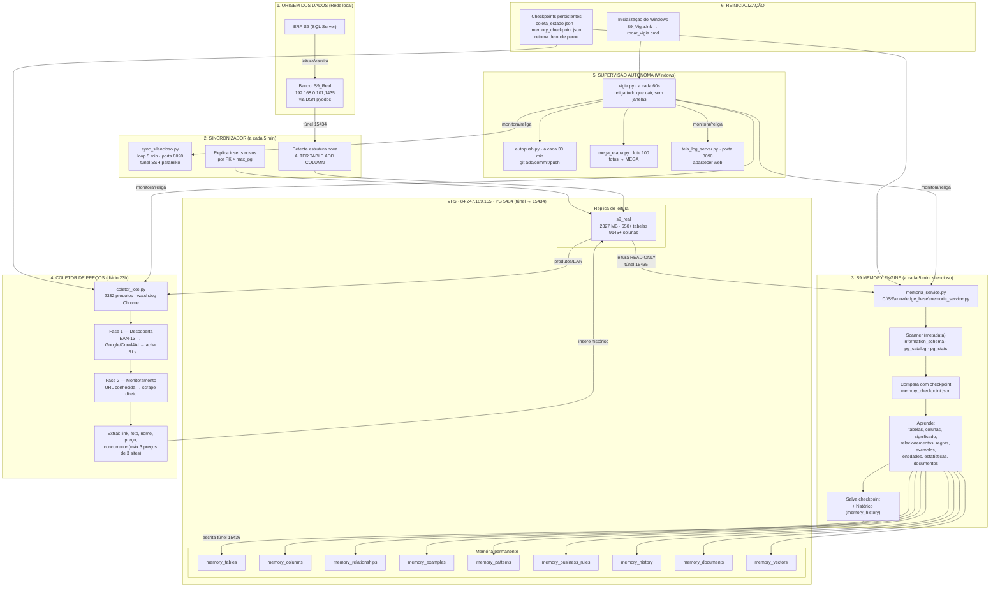

# S9 — Arquitetura Atual (implementada e validada)

> Gerado em 2026-08-01 · Estado real do sistema em produção (C:\S9)

## 1. Diagrama completo (Mermaid)



## 2. Explicação de cada bloco

| Bloco | O que faz |
|---|---|
| **1. Origem** | ERP S9 em SQL Server (`S9_Real`) — dados de produção: produtos, EAN, clientes, fornecedores, vendas, estoque, movimentos, fiscal. |
| **2. Sincronizador** | `sync_silencioso.py` replica SQL Server → PostgreSQL a cada 5 min via túnel SSH. Detecta colunas novas e aplica `ALTER TABLE ADD COLUMN` na réplica. Só insere registros novos (por PK > max). |
| **3. Memory Engine** | `memoria_service.py` lê a réplica **somente leitura** (túnel 15435), compara com o checkpoint, aprende estrutura/significado/relacionamentos/regras e escreve **apenas** nas tabelas `memory_*` (túnel 15436). Nunca toca no `s9_real`. |
| **4. Coletor** | `coletor_lote.py` coleta preços concorrentes: fase 1 descobre URLs via Google/Crawl4AI (EAN-13), fase 2 monitora as URLs já conhecidas. Salva histórico com link/foto/nome/preço/concorrente. |
| **5. Supervisão** | `vigia.py` roda sempre e religa coletor, sync, memory service e tela se caírem. `autopush.py` envia mudanças ao GitHub. `mega_etapa.py` sobe fotos ao MEGA. |
| **6. Reinicialização** | Na inicialização do Windows, `S9_Vigia.lnk` → `rodar_vigia.cmd` sobe o vigia, que religa tudo. Checkpoints (`coleta_estado.json`, `memory_checkpoint.json`) garantem retomada sem perder progresso. Tudo oculto (pythonw, `CREATE_NO_WINDOW`). |

## 3. Bancos de dados

| Banco | Servidor | Papel |
|---|---|---|
| `S9_Real` | SQL Server local (192.168.0.101,1435) | Produção (origem) |
| `s9_real` | VPS PostgreSQL 14.23 (túnel → 15434) | Réplica de leitura, 650+ tabelas, 9145+ colunas |
| `postgres` (schema `memory_*`) | VPS PostgreSQL (túnel → 15436) | Memória permanente do ERP — **23 tabelas** |
| `postgres` (DB base) | VPS PostgreSQL | Banco administrativo do servidor PG |

## 4. Serviços em execução (Windows, todos silenciosos)

| Serviço | Script | Intervalo | Função |
|---|---|---|---|
| Vigia | `vigia.py` | 60 s | Supervisor: religa tudo que cair |
| Sincronizador | `sync_silencioso.py` | 5 min | SQL Server → s9_real |
| Memory Engine | `knowledge_base\memoria_service.py` | 5 min | Aprende o ERP → memory_* |
| Coletor | `coletor_lote.py` | diário 23 h (+checkpoint) | Preços concorrentes |
| Tela | `tela_log_server.py` | contínuo | Painel web (porta 8090) |
| Autopush | `autopush.py` | 30 min | Backup GitHub |
| MEGA | `mega_etapa.py` | 20 min | Upload de fotos |

## 5. Fluxo completo de dados

```
ERP SQL Server (S9_Real)
        │ sync_silencioso.py (túnel 15434)
        ▼
   s9_real (réplica PG VPS)
        │
        ├── memoria_service.py (READ ONLY, túnel 15435) ──► memory_* (túnel 15436)
        │
        └── coletor_lote.py (EAN-13 → Google/Crawl4AI → scrape) ──► histórico de preços
                                                                (volta para s9_real)

vigia.py mantém tudo vivo, sem nenhuma janela.
```

## 6. Aprendizado incremental (ciclo de 5 min)

```
a cada 5 minutos
   ↓
1. ler alterações do s9_real (metadata: information_schema, pg_catalog, pg_stats)
   ↓
2. comparar com memory_checkpoint.json (hash do schema)
   ↓
3. detectar novidades (tabelas/colunas/tipos/FKs novas)
   ↓
4. atualizar conhecimento nas memory_*
   ↓
5. registrar em memory_history
   ↓
6. salvar novo checkpoint
   ↓
aguardar próximo ciclo
```

> Prova de que funciona: o **ciclo 7** detectou sozinho as novas tabelas `supplier_score` e `product_sources` (chegaram via sync) e aprendeu +25 colunas sem reprocessar as 650 existentes.
